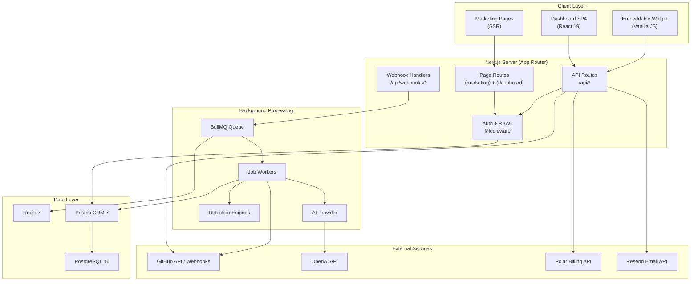

# System Architecture

This document describes the high-level architecture of Changeloger, including the request and data flows, layer responsibilities, key design decisions, and technology choices.

---

## High-Level Architecture Diagram

## Request and Data Flows

### 1. Onboarding Flow

1. User signs in via Google or GitHub OAuth.
2. A `User` record is created (or matched) along with an `OAuthAccount`.
3. A JWT session is issued and stored in the `sessions` table.
4. User creates a `Workspace`, which automatically creates a `WorkspaceMember` with the `owner` role.
5. User installs the GitHub App, which triggers a callback that creates a `GithubInstallation` and syncs available repositories.
6. User selects repositories to connect, creating `Repository` records linked to the workspace.

### 2. Ingestion Flow

1. GitHub delivers a webhook event (push, tag creation, or release) to `/api/webhooks/github`.
2. The handler verifies the HMAC-SHA256 signature using `GITHUB_APP_WEBHOOK_SECRET`.
3. The handler checks for idempotency (duplicate commit SHAs are rejected).
4. A background job is enqueued via BullMQ with the event payload.

### 3. Processing Flow

1. The `process-webhook` worker picks up the job from the Redis-backed queue.
2. For push events, the worker runs the **commit analyzer** to parse conventional commits and group related changes.
3. The **diff detector** fetches file-level diffs from the GitHub Compare API and identifies structural code changes (new functions, deleted files, API endpoint changes, dependency updates).
4. The **version watcher** checks for manifest file changes and tag correlation.
5. Results from all three engines are merged and deduplicated.
6. The merged results are sent to the AI provider for summarization into user-facing changelog entries.
7. A draft `Release` is created with `ChangelogEntry` records attached.

### 4. Editing Flow

1. Team members open the draft release in the dashboard editor.
2. Entries can be reordered via drag-and-drop, edited inline, recategorized, and have their impact level adjusted.
3. Each save creates a `ReleaseRevision` snapshot for audit history.
4. Real-time collaborative editing is supported via WebSocket for cursor presence and last-write-wins conflict resolution.

### 5. Publishing Flow

1. An authorized user clicks "Publish" in the editor.
2. The publish handler validates all entries, sets the `publishedAt` timestamp, and transitions the release status from `draft` to `published`.
3. The release is rendered into Markdown, HTML, and JSON formats.
4. The published changelog is now accessible through the widget API.

### 6. Widget Consumption Flow

1. A website embeds the Changeloger widget via a `<script>` tag with a unique `embedToken`.
2. The widget fetches changelog data from `/api/widgets/[embedToken]/changelog`.
3. The API validates the token and checks domain whitelisting before serving data.
4. The widget renders the changelog and reports anonymized analytics events (page views, entry clicks, scroll depth) back to `/api/widgets/[embedToken]/events`.

---

## Layer Descriptions

### Frontend Layer

Two route groups powered by the Next.js App Router:

- **(marketing)** -- Server-rendered public pages (landing, pricing, features, blog, legal). Optimized for SEO and fast initial loads.
- **(dashboard)** -- Authenticated single-page application for workspace management, changelog editing, analytics, team administration, and billing. Uses TanStack React Query for server state and Zustand for client state.

The UI is built with Radix UI primitives via shadcn/ui, styled with Tailwind CSS 4, and uses Framer Motion for animations. The Inter font is used for body text and JetBrains Mono for code elements.

### API Layer

RESTful API routes under `/api/*` handle all data operations:

- `/api/auth/*` -- OAuth initiation, callback handling, session management, logout.
- `/api/workspaces/*` -- Workspace CRUD, member management, invitation lifecycle.
- `/api/repositories/*` -- Repository connection, configuration, release management, entry CRUD, publish flow.
- `/api/billing/*` -- Checkout initiation and customer portal redirect.
- `/api/widgets/*` -- Widget CRUD, changelog data serving, analytics event ingestion.
- `/api/github/*` -- GitHub App installation callback.

### Authentication and Authorization Layer

- **OAuth 2.0** with Google and GitHub as identity providers.
- **JWT-based sessions** with short-lived access tokens (15-minute default) and longer-lived refresh tokens (7-day default). Token hashes are stored in the `sessions` table.
- **Role-based access control (RBAC)** with four workspace roles: `owner`, `admin`, `editor`, `viewer`. Enforced at the API middleware level.

### Integration Layer

- **GitHub** -- Octokit client authenticated via GitHub App installation tokens. Handles API calls for repository listing, commit fetching, diff comparison, and tag retrieval.
- **Polar** -- Subscription billing with checkout, customer portal, and webhook-driven lifecycle management.
- **Resend** -- Transactional email delivery for workspace invitations.
- **OpenAI** -- AI-powered commit summarization, change description, commit classification, and release notes generation.

### Processing Layer

- **BullMQ** job queue backed by Redis for asynchronous webhook processing and change analysis.
- **Detection engines** -- Three engines (commit analyzer, diff detector, version watcher) run in sequence to extract structured change data from GitHub events.
- **AI provider** -- Pluggable interface with an OpenAI implementation. Supports caching via Redis with a 7-day TTL and rate limiting.

### Storage Layer

- **PostgreSQL 16** as the primary relational database, accessed through Prisma ORM 7 with the `@prisma/adapter-pg` driver adapter.
- **Redis 7** serves dual duty as the BullMQ job queue backend and the AI response cache.

### Widget Layer

A standalone JavaScript bundle (targeting less than 30KB gzipped) built with esbuild. Available in three variants:

- **Page** -- Full-page changelog renderer.
- **Modal** -- Overlay triggered by a button.
- **Badge** -- Notification dot or count indicator.

Configuration is passed via data attributes on the script tag. The widget reports analytics events for engagement tracking.

### Analytics Layer

- Anonymized browser fingerprinting (user agent + screen + timezone hash) for unique visitor tracking.
- Raw events stored in `analytics_events` with a daily rollup job that aggregates into `analytics_daily`.
- GDPR opt-out support via a data attribute on the widget script tag.
- Dashboard visualization with Recharts (time-series, bar charts, pie/donut charts, heatmaps).

---

## Key Design Decisions

### Event-driven processing over synchronous analysis

Webhook events are immediately acknowledged and enqueued for background processing rather than being analyzed synchronously. This ensures GitHub receives a timely response (preventing webhook delivery retries), allows the detection pipeline to scale independently of API request throughput, and provides natural retry semantics for transient failures.

### Three-engine architecture over single-pass analysis

Rather than relying solely on commit message parsing, the system runs three complementary detection engines. Conventional commit messages provide high-confidence structured data when available. Diff analysis catches changes that were poorly described in commit messages. Version monitoring ensures that release boundaries are correctly identified even when tagging practices vary. The engines produce overlapping results that are merged and deduplicated, maximizing coverage.

### AI as an enhancement layer, not a requirement

The AI provider summarizes and polishes changelog entries but is not required for the pipeline to function. The commit analyzer and diff detector produce usable entries on their own. AI generation is quota-limited per workspace plan and cached to reduce costs. The pluggable provider interface allows teams to choose their preferred AI backend or disable it entirely.

### Workspace-scoped multi-tenancy

All data is scoped to a workspace via `workspace_id` foreign keys rather than using database-level isolation. This simplifies the schema, keeps query patterns uniform, and allows flexible sharing via the invitation and role system. Plan enforcement and billing are applied at the workspace level.

### Embeddable widget as the primary distribution channel

Rather than requiring users to visit a separate changelog page, the widget brings the changelog to the user's own product. Domain whitelisting, token-based authentication, and anonymized analytics ensure security and privacy without requiring end-user authentication.

---

## Technology Choices

| Decision | Choice | Rationale |
|---|---|---|
| Framework | Next.js 16 (App Router) | Unified server and client rendering, API routes collocated with pages, streaming and server components for performance. |
| ORM | Prisma 7 | Type-safe database access, declarative schema, migration tooling, driver adapter support for native `pg`. |
| Job Queue | BullMQ + Redis | Battle-tested Node.js queue with retry, backoff, concurrency control, and rate limiting. Redis provides persistence. |
| UI Components | shadcn/ui + Radix | Accessible, unstyled primitives that can be composed and themed with Tailwind CSS. Copy-paste ownership model. |
| State Management | Zustand + TanStack Query | Zustand for lightweight client state, TanStack Query for server state with caching, revalidation, and optimistic updates. |
| AI Provider | OpenAI (pluggable) | GPT-4o-mini offers good quality at low cost. The provider interface allows swapping to Anthropic, Ollama, or other backends. |
| Billing | Polar | Developer-focused billing platform with subscription management, webhooks, and a customer portal. |
| Email | Resend | Simple transactional email API with React-based template support. |
| Validation | Zod 4 | Runtime schema validation with TypeScript type inference, used for API input validation and configuration parsing. |
| Charts | Recharts | Composable React charting library built on D3, suitable for the dashboard analytics visualizations. |

---

## Data Flow Diagram

```mermaid
flowchart LR
    A["GitHub Webhook<br/>(push / tag / release)"] --> B["Webhook Handler<br/>Signature Verification"]
    B --> C["BullMQ Queue<br/>(Redis)"]
    C --> D["Commit Analyzer<br/>Parse + Group"]
    D --> E["Diff Detector<br/>Structural Analysis"]
    E --> F["Version Watcher<br/>Manifest + Tags"]
    F --> G["Merge + Deduplicate"]
    G --> H["AI Provider<br/>Summarize + Polish"]
    H --> I["Draft Release<br/>(ChangelogEntries)"]
    I --> J["Collaborative Editor<br/>Review + Reorder"]
    J --> K["Publish"]
    K --> L["Widget API<br/>(embed token + domain check)"]
    L --> M["Embeddable Widget<br/>Page / Modal / Badge"]
    M --> N["Analytics Events"]
    N --> O["Daily Aggregation"]
```

