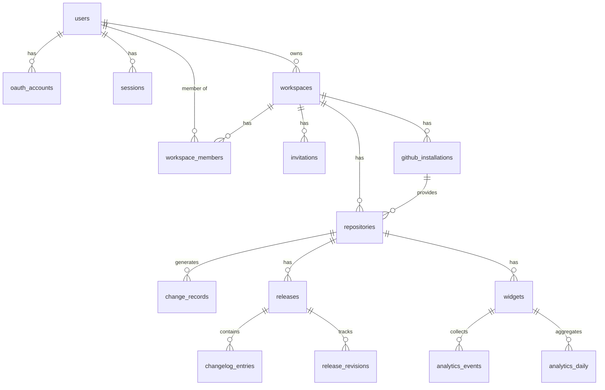

# Database Schema

Changeloger uses PostgreSQL 16 with Prisma ORM. The schema supports multi-tenant SaaS with workspace-level isolation.

## Entity Relationship Diagram



## Tables

### users

Core user accounts. One row per unique email regardless of OAuth provider.

| Column | Type | Constraints | Description |
|--------|------|-------------|-------------|
| id | UUID | PK, default uuid | |
| email | VARCHAR | UNIQUE, NOT NULL | |
| name | VARCHAR | NULLABLE | |
| avatar_url | VARCHAR | NULLABLE | |
| created_at | TIMESTAMP | NOT NULL, default now() | |
| updated_at | TIMESTAMP | NOT NULL, auto-updated | |

### oauth_accounts

Linked OAuth accounts. A user can have both Google and GitHub linked.

| Column | Type | Constraints | Description |
|--------|------|-------------|-------------|
| id | UUID | PK | |
| user_id | UUID | FK -> users, NOT NULL | |
| provider | ENUM | NOT NULL | `google` or `github` |
| provider_user_id | VARCHAR | NOT NULL | Provider's user ID |
| access_token | VARCHAR | NULLABLE | OAuth access token |
| refresh_token | VARCHAR | NULLABLE | OAuth refresh token |
| token_expires_at | TIMESTAMP | NULLABLE | |
| created_at | TIMESTAMP | NOT NULL | |

**Unique:** (provider, provider_user_id)
**Index:** user_id

### sessions

Active user sessions. JWT tokens with server-side validation.

| Column | Type | Constraints | Description |
|--------|------|-------------|-------------|
| id | UUID | PK | |
| user_id | UUID | FK -> users, NOT NULL | |
| token_hash | VARCHAR | NOT NULL | Hash for lookup |
| expires_at | TIMESTAMP | NOT NULL | |
| ip_address | VARCHAR | NULLABLE | |
| user_agent | VARCHAR | NULLABLE | |
| created_at | TIMESTAMP | NOT NULL | |

**Indexes:** user_id, token_hash

### workspaces

Organizational unit. One per team. Owns repositories and billing.

| Column | Type | Constraints | Description |
|--------|------|-------------|-------------|
| id | UUID | PK | |
| name | VARCHAR | NOT NULL | |
| slug | VARCHAR | UNIQUE, NOT NULL | URL-safe identifier |
| owner_id | UUID | FK -> users | |
| plan | ENUM | NOT NULL, default `free` | free/pro/team/enterprise |
| polar_customer_id | VARCHAR | NULLABLE | Polar billing ID |
| polar_subscription_id | VARCHAR | NULLABLE | Active subscription |
| trial_ends_at | TIMESTAMP | NULLABLE | Pro trial expiry |
| ai_generations_used | INTEGER | NOT NULL, default 0 | Current cycle usage |
| billing_cycle_start | TIMESTAMP | NULLABLE | |
| created_at | TIMESTAMP | NOT NULL | |
| updated_at | TIMESTAMP | NOT NULL | |

### workspace_members

Membership junction table with role assignment.

| Column | Type | Constraints | Description |
|--------|------|-------------|-------------|
| id | UUID | PK | |
| workspace_id | UUID | FK -> workspaces | |
| user_id | UUID | FK -> users | |
| role | ENUM | NOT NULL, default `viewer` | owner/admin/editor/viewer |
| invited_by | UUID | NULLABLE | |
| joined_at | TIMESTAMP | NOT NULL | |

**Unique:** (workspace_id, user_id)

### invitations

Pending email invitations. Expire after 7 days.

| Column | Type | Constraints | Description |
|--------|------|-------------|-------------|
| id | UUID | PK | |
| workspace_id | UUID | FK -> workspaces | |
| email | VARCHAR | NOT NULL | |
| role | ENUM | NOT NULL | |
| invited_by_id | UUID | FK -> users | |
| token | UUID | UNIQUE | Invitation link token |
| expires_at | TIMESTAMP | NOT NULL | |
| accepted_at | TIMESTAMP | NULLABLE | |
| created_at | TIMESTAMP | NOT NULL | |

### github_installations

GitHub App installations. One per GitHub account (user or org).

| Column | Type | Constraints | Description |
|--------|------|-------------|-------------|
| id | UUID | PK | |
| workspace_id | UUID | FK -> workspaces | |
| installation_id | INTEGER | UNIQUE | GitHub installation ID |
| account_login | VARCHAR | NOT NULL | GitHub username/org |
| account_type | VARCHAR | NOT NULL | "User" or "Organization" |
| access_token | VARCHAR | NULLABLE | Installation token (encrypted) |
| token_expires_at | TIMESTAMP | NULLABLE | 1-hour expiry |
| created_at | TIMESTAMP | NOT NULL | |
| updated_at | TIMESTAMP | NOT NULL | |

### repositories

Connected GitHub repositories.

| Column | Type | Constraints | Description |
|--------|------|-------------|-------------|
| id | UUID | PK | |
| workspace_id | UUID | FK -> workspaces | |
| github_installation_id | UUID | FK -> github_installations | |
| github_repo_id | INTEGER | NOT NULL | GitHub repo numeric ID |
| name | VARCHAR | NOT NULL | |
| full_name | VARCHAR | NOT NULL | owner/repo format |
| default_branch | VARCHAR | default "main" | |
| language | VARCHAR | NULLABLE | Primary language |
| is_active | BOOLEAN | default true | Monitoring enabled |
| config | JSONB | default {} | See below |
| created_at | TIMESTAMP | NOT NULL | |
| updated_at | TIMESTAMP | NOT NULL | |

**Unique:** (workspace_id, github_repo_id)

**Config JSONB schema:**

```json
{
  "monitoredBranches": ["main"],
  "ignorePaths": ["*.lock", "dist/**"],
  "aiEnabled": true,
  "autoDetectVersionBumps": true
}
```

### change_records

Raw change data from detection engines. One row per detected change.

| Column | Type | Constraints | Description |
|--------|------|-------------|-------------|
| id | UUID | PK | |
| repository_id | UUID | FK -> repositories | |
| source | ENUM | NOT NULL | commit/diff/version |
| commit_sha | VARCHAR | NULLABLE | |
| type | VARCHAR | NULLABLE | feat, fix, etc. |
| scope | VARCHAR | NULLABLE | |
| subject | VARCHAR | NOT NULL | |
| body | TEXT | NULLABLE | |
| files_changed | JSONB | NULLABLE | |
| breaking | BOOLEAN | default false | |
| confidence | FLOAT | default 1.0 | |
| impact | ENUM | default medium | |
| authors | JSONB | default [] | |
| timestamp | TIMESTAMP | NOT NULL | |
| metadata | JSONB | default {} | |
| created_at | TIMESTAMP | NOT NULL | |

### changelog_entries

Processed, human-readable entries in a release.

| Column | Type | Constraints | Description |
|--------|------|-------------|-------------|
| id | UUID | PK | |
| release_id | UUID | FK -> releases | |
| category | ENUM | NOT NULL | added/fixed/changed/etc. |
| title | VARCHAR | NOT NULL | |
| description | TEXT | NULLABLE | |
| impact | ENUM | default medium | |
| breaking | BOOLEAN | default false | |
| source_record_ids | UUID[] | | Links to change_records |
| authors | JSONB | default [] | |
| position | INTEGER | default 0 | Sort order in editor |
| reviewed | BOOLEAN | default false | |
| created_at | TIMESTAMP | NOT NULL | |
| updated_at | TIMESTAMP | NOT NULL | |

### releases

Versioned changelog releases.

| Column | Type | Constraints | Description |
|--------|------|-------------|-------------|
| id | UUID | PK | |
| repository_id | UUID | FK -> repositories | |
| version | VARCHAR | NOT NULL | Semver string |
| date | TIMESTAMP | default now() | |
| tag | VARCHAR | NULLABLE | Git tag |
| status | ENUM | default draft | draft/published/archived |
| summary | TEXT | NULLABLE | Rendered markdown |
| commit_range | JSONB | NULLABLE | { from, to } SHAs |
| published_at | TIMESTAMP | NULLABLE | |
| published_by | UUID | FK -> users, NULLABLE | |
| created_at | TIMESTAMP | NOT NULL | |
| updated_at | TIMESTAMP | NOT NULL | |

**Unique:** (repository_id, version)

### release_revisions

Revision history. Full snapshot per publish.

| Column | Type | Constraints | Description |
|--------|------|-------------|-------------|
| id | UUID | PK | |
| release_id | UUID | FK -> releases | |
| snapshot | JSONB | NOT NULL | Full entry state at publish |
| created_by | UUID | FK -> users | |
| created_at | TIMESTAMP | NOT NULL | |

### widgets

Widget configurations with embed tokens.

| Column | Type | Constraints | Description |
|--------|------|-------------|-------------|
| id | UUID | PK | |
| repository_id | UUID | FK -> repositories | |
| type | ENUM | NOT NULL | page/modal/badge |
| embed_token | UUID | UNIQUE | Public identifier |
| config | JSONB | default {} | Colors, fonts, etc. |
| domains | VARCHAR[] | default [] | Whitelisted domains |
| created_at | TIMESTAMP | NOT NULL | |
| updated_at | TIMESTAMP | NOT NULL | |

### analytics_events

Raw analytics events from widget interactions. Consider monthly partitioning for scale.

| Column | Type | Constraints | Description |
|--------|------|-------------|-------------|
| id | UUID | PK | |
| widget_id | UUID | FK -> widgets | |
| event_type | ENUM | NOT NULL | page_view/entry_click/scroll_depth/session_end |
| entry_id | UUID | NULLABLE | Clicked entry |
| visitor_hash | VARCHAR | NOT NULL | Anonymized fingerprint |
| referrer | VARCHAR | NULLABLE | |
| metadata | JSONB | default {} | |
| timestamp | TIMESTAMP | NOT NULL | |

**Indexes:** widget_id, timestamp, event_type

### analytics_daily

Pre-aggregated daily rollups for fast dashboard queries.

| Column | Type | Constraints | Description |
|--------|------|-------------|-------------|
| id | UUID | PK | |
| widget_id | UUID | FK -> widgets | |
| date | DATE | NOT NULL | |
| page_views | INTEGER | default 0 | |
| unique_visitors | INTEGER | default 0 | |
| entry_clicks | JSONB | default {} | Per-entry click counts |
| avg_read_depth | FLOAT | NULLABLE | |
| avg_time_on_page | FLOAT | NULLABLE | |

**Unique:** (widget_id, date)

## Multi-Tenancy

All data tables include a `workspace_id` (directly or via repository/widget). Queries are scoped to the authenticated user's workspace via middleware. PostgreSQL Row-Level Security (RLS) policies provide defense-in-depth.

## Migration Workflow

```bash
# Create a migration after schema changes
npx prisma migrate dev --name description_of_change

# Apply migrations in production
npx prisma migrate deploy

# Reset database (development only)
npx prisma migrate reset

# View schema in browser
npx prisma studio
```
