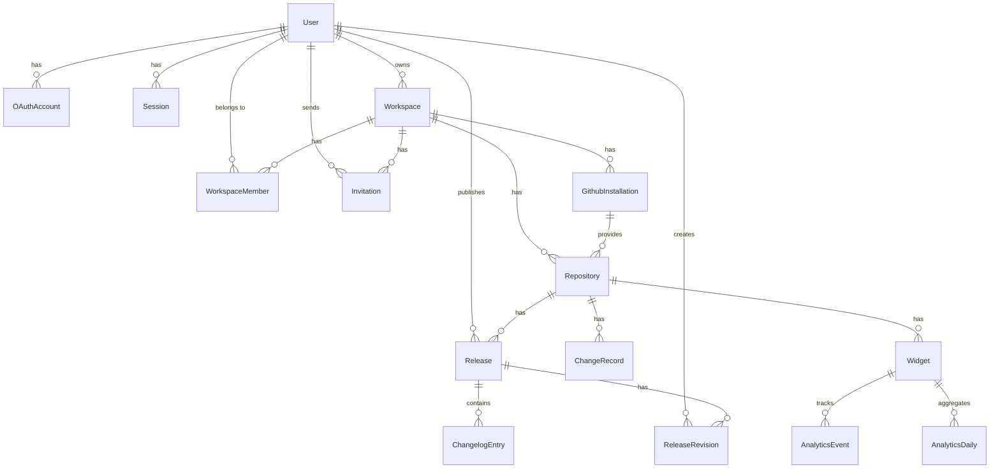

# Database Schema Documentation

This document describes the PostgreSQL database schema used by Changeloger, including entity relationships, table definitions, indexing strategy, JSONB column schemas, the multi-tenancy approach, and the migration workflow.

---

## Entity Relationship Overview



---

## Enums

The schema defines the following PostgreSQL enums:

| Enum | Values | Usage |
|---|---|---|
| `OAuthProvider` | `google`, `github` | Identity provider for OAuth accounts |
| `WorkspaceRole` | `owner`, `admin`, `editor`, `viewer` | Permission level within a workspace |
| `WorkspacePlan` | `free`, `pro`, `team`, `enterprise` | Subscription tier |
| `ReleaseStatus` | `draft`, `published`, `archived` | Release lifecycle state |
| `WidgetType` | `page`, `modal`, `badge` | Widget display variant |
| `ChangeSource` | `commit`, `diff`, `version` | Which detection engine produced the record |
| `EventType` | `page_view`, `entry_click`, `scroll_depth`, `session_end` | Analytics event classification |
| `ImpactLevel` | `critical`, `high`, `medium`, `low`, `negligible` | Severity of a change |
| `ChangeCategory` | `added`, `fixed`, `changed`, `removed`, `deprecated`, `security`, `performance`, `documentation`, `maintenance`, `breaking` | Changelog entry category |

---

## Table-by-Table Documentation

### users

Stores registered user accounts. One row per unique email address regardless of how many OAuth providers are linked. All workspace memberships, published releases, and revision history reference this table.

| Column | Type | Constraints | Description |
|---|---|---|---|
| `id` | `UUID` | PK, default `uuid()` | Unique user identifier |
| `email` | `String` | Unique, not null | User email address |
| `name` | `String?` | Nullable | Display name |
| `avatar_url` | `String?` | Nullable | Profile image URL from OAuth provider |
| `created_at` | `DateTime` | Not null, default `now()` | Account creation timestamp |
| `updated_at` | `DateTime` | Not null, auto-updated | Last modification timestamp |

**Mapped table name:** `users`

### oauth_accounts

Links users to their external OAuth identities. A single user can have both a Google and a GitHub account linked simultaneously, enabling sign-in from either provider.

| Column | Type | Constraints | Description |
|---|---|---|---|
| `id` | `UUID` | PK, default `uuid()` | Record identifier |
| `user_id` | `UUID` | FK -> users, cascade delete | Owning user |
| `provider` | `OAuthProvider` | Not null | OAuth provider (`google` or `github`) |
| `provider_user_id` | `String` | Not null | External user ID from the provider |
| `access_token` | `String?` | Nullable | OAuth access token (encrypted at rest) |
| `refresh_token` | `String?` | Nullable | OAuth refresh token |
| `token_expires_at` | `DateTime?` | Nullable | Token expiration time |
| `created_at` | `DateTime` | Not null, default `now()` | Record creation timestamp |

**Indexes:** `(user_id)` | **Unique constraint:** `(provider, provider_user_id)`
**Mapped table name:** `oauth_accounts`

### sessions

Active JWT session records. The raw JWT token is never stored; only a hash of the token is persisted for server-side validation and revocation.

| Column | Type | Constraints | Description |
|---|---|---|---|
| `id` | `UUID` | PK, default `uuid()` | Session identifier |
| `user_id` | `UUID` | FK -> users, cascade delete | Session owner |
| `token_hash` | `String` | Not null, indexed | Hashed JWT for lookup |
| `expires_at` | `DateTime` | Not null | Session expiration time |
| `ip_address` | `String?` | Nullable | Client IP at session creation |
| `user_agent` | `String?` | Nullable | Client user agent string |
| `created_at` | `DateTime` | Not null, default `now()` | Session creation timestamp |

**Indexes:** `(user_id)`, `(token_hash)`
**Mapped table name:** `sessions`

### workspaces

Top-level organizational unit. All repositories, team members, and billing are scoped to a workspace. The owner is the user who created the workspace and has full administrative control.

| Column | Type | Constraints | Description |
|---|---|---|---|
| `id` | `UUID` | PK, default `uuid()` | Workspace identifier |
| `name` | `String` | Not null | Display name |
| `slug` | `String` | Unique, not null | URL-safe identifier for routing |
| `owner_id` | `UUID` | FK -> users | Workspace creator and primary administrator |
| `plan` | `WorkspacePlan` | Not null, default `free` | Current subscription tier |
| `polar_customer_id` | `String?` | Nullable | Polar billing customer ID |
| `polar_subscription_id` | `String?` | Nullable | Active Polar subscription ID |
| `trial_ends_at` | `DateTime?` | Nullable | Pro trial expiration date |
| `ai_generations_used` | `Int` | Not null, default `0` | AI generation count in current billing cycle |
| `billing_cycle_start` | `DateTime?` | Nullable | Start of the current billing cycle |
| `created_at` | `DateTime` | Not null, default `now()` | Creation timestamp |
| `updated_at` | `DateTime` | Not null, auto-updated | Last modification timestamp |

**Indexes:** `(owner_id)`
**Mapped table name:** `workspaces`

### workspace_members

Junction table associating users with workspaces and assigning their permission level. A user cannot be a member of the same workspace twice (enforced by a unique constraint).

| Column | Type | Constraints | Description |
|---|---|---|---|
| `id` | `UUID` | PK, default `uuid()` | Record identifier |
| `workspace_id` | `UUID` | FK -> workspaces, cascade delete | Parent workspace |
| `user_id` | `UUID` | FK -> users, cascade delete | Member user |
| `role` | `WorkspaceRole` | Not null, default `viewer` | Permission level |
| `invited_by` | `UUID?` | Nullable | User who sent the invitation |
| `joined_at` | `DateTime` | Not null, default `now()` | When the member joined |

**Indexes:** `(user_id)` | **Unique constraint:** `(workspace_id, user_id)`
**Mapped table name:** `workspace_members`

### invitations

Pending workspace invitations sent via email. Each invitation has a unique token used in the acceptance URL. Invitations expire after a configured period and can only be accepted once.

| Column | Type | Constraints | Description |
|---|---|---|---|
| `id` | `UUID` | PK, default `uuid()` | Record identifier |
| `workspace_id` | `UUID` | FK -> workspaces, cascade delete | Target workspace |
| `email` | `String` | Not null, indexed | Invitee email address |
| `role` | `WorkspaceRole` | Not null, default `viewer` | Role to assign upon acceptance |
| `invited_by_id` | `UUID` | FK -> users | User who sent the invitation |
| `token` | `String` | Unique, default `uuid()` | One-time acceptance token |
| `expires_at` | `DateTime` | Not null | Invitation expiration |
| `accepted_at` | `DateTime?` | Nullable | When the invitation was accepted (null if pending) |
| `created_at` | `DateTime` | Not null, default `now()` | Creation timestamp |

**Indexes:** `(workspace_id)`, `(email)`, `(token)`
**Mapped table name:** `invitations`

### github_installations

Tracks GitHub App installations associated with a workspace. Each installation represents a connection to a GitHub user account or organization and provides access tokens for API calls.

| Column | Type | Constraints | Description |
|---|---|---|---|
| `id` | `UUID` | PK, default `uuid()` | Record identifier |
| `workspace_id` | `UUID` | FK -> workspaces, cascade delete | Parent workspace |
| `installation_id` | `Int` | Unique, not null | GitHub App installation ID |
| `account_login` | `String` | Not null | GitHub account login (user or org name) |
| `account_type` | `String` | Not null | `"User"` or `"Organization"` |
| `access_token` | `String?` | Nullable | Current installation access token |
| `token_expires_at` | `DateTime?` | Nullable | Token expiration (typically 1 hour) |
| `created_at` | `DateTime` | Not null, default `now()` | Creation timestamp |
| `updated_at` | `DateTime` | Not null, auto-updated | Last modification timestamp |

**Indexes:** `(workspace_id)` | **Unique constraint:** `(installation_id)`
**Mapped table name:** `github_installations`

### repositories

Connected GitHub repositories being monitored for changes. Each repository belongs to a workspace and is linked to a GitHub App installation that provides API access. The `config` JSONB column stores per-repository settings for branch filtering, path ignoring, and AI configuration.

| Column | Type | Constraints | Description |
|---|---|---|---|
| `id` | `UUID` | PK, default `uuid()` | Record identifier |
| `workspace_id` | `UUID` | FK -> workspaces, cascade delete | Parent workspace |
| `github_installation_id` | `UUID` | FK -> github_installations, cascade delete | Providing installation |
| `github_repo_id` | `Int` | Not null | GitHub numeric repository ID |
| `name` | `String` | Not null | Repository short name |
| `full_name` | `String` | Not null | Full name in `owner/repo` format |
| `default_branch` | `String` | Not null, default `"main"` | Default branch name |
| `language` | `String?` | Nullable | Primary programming language |
| `is_active` | `Boolean` | Not null, default `true` | Whether change detection is enabled |
| `config` | `JSONB` | Not null, default `{}` | Per-repo configuration (see JSONB section) |
| `created_at` | `DateTime` | Not null, default `now()` | Creation timestamp |
| `updated_at` | `DateTime` | Not null, auto-updated | Last modification timestamp |

**Indexes:** `(workspace_id)`, `(github_installation_id)` | **Unique constraint:** `(workspace_id, github_repo_id)`
**Mapped table name:** `repositories`

### change_records

Raw change data produced by the detection engines before AI processing. Each record represents a single detected change and includes metadata specific to the engine that produced it.

| Column | Type | Constraints | Description |
|---|---|---|---|
| `id` | `UUID` | PK, default `uuid()` | Record identifier |
| `repository_id` | `UUID` | FK -> repositories, cascade delete | Source repository |
| `source` | `ChangeSource` | Not null | Which engine produced this record (`commit`, `diff`, `version`) |
| `commit_sha` | `String?` | Nullable, indexed | Associated Git commit SHA |
| `type` | `String?` | Nullable | Conventional commit type (`feat`, `fix`, `chore`, etc.) |
| `scope` | `String?` | Nullable | Conventional commit scope |
| `subject` | `String` | Not null | One-line change summary |
| `body` | `String?` | Nullable | Extended description |
| `files_changed` | `JSONB?` | Nullable | List of changed files (see JSONB section) |
| `breaking` | `Boolean` | Not null, default `false` | Whether this is a breaking change |
| `confidence` | `Float` | Not null, default `1.0` | Engine confidence score (0.0 to 1.0) |
| `impact` | `ImpactLevel` | Not null, default `medium` | Assessed impact level |
| `authors` | `JSONB` | Not null, default `[]` | Author information (see JSONB section) |
| `timestamp` | `DateTime` | Not null, indexed | When the change occurred in Git |
| `metadata` | `JSONB` | Not null, default `{}` | Engine-specific metadata (see JSONB section) |
| `created_at` | `DateTime` | Not null, default `now()` | Record creation timestamp |

**Indexes:** `(repository_id)`, `(commit_sha)`, `(timestamp)`
**Mapped table name:** `change_records`

### changelog_entries

User-facing changelog entries belonging to a release. These are the polished, reviewed items that appear in the published changelog. Each entry is linked back to one or more source `ChangeRecord` records via the `source_record_ids` array.

| Column | Type | Constraints | Description |
|---|---|---|---|
| `id` | `UUID` | PK, default `uuid()` | Entry identifier |
| `release_id` | `UUID` | FK -> releases, cascade delete | Parent release |
| `category` | `ChangeCategory` | Not null | Entry category (`added`, `fixed`, `changed`, etc.) |
| `title` | `String` | Not null | Entry headline |
| `description` | `String?` | Nullable | Extended description (Markdown supported) |
| `impact` | `ImpactLevel` | Not null, default `medium` | Impact classification |
| `breaking` | `Boolean` | Not null, default `false` | Breaking change flag |
| `source_record_ids` | `UUID[]` | Array | IDs of source `ChangeRecord` records |
| `authors` | `JSONB` | Not null, default `[]` | Author information |
| `position` | `Int` | Not null, default `0` | Display order within the release (used by drag-and-drop editor) |
| `reviewed` | `Boolean` | Not null, default `false` | Whether an editor has reviewed this entry |
| `created_at` | `DateTime` | Not null, default `now()` | Creation timestamp |
| `updated_at` | `DateTime` | Not null, auto-updated | Last modification timestamp |

**Indexes:** `(release_id)`
**Mapped table name:** `changelog_entries`

### releases

Versioned releases for a repository. Each release contains multiple changelog entries and progresses through `draft`, `published`, and `archived` states. The version is unique per repository.

| Column | Type | Constraints | Description |
|---|---|---|---|
| `id` | `UUID` | PK, default `uuid()` | Release identifier |
| `repository_id` | `UUID` | FK -> repositories, cascade delete | Parent repository |
| `version` | `String` | Not null | Semantic version string (e.g., `1.3.0`) |
| `date` | `DateTime` | Not null, default `now()` | Release date |
| `tag` | `String?` | Nullable | Associated Git tag (e.g., `v1.3.0`) |
| `status` | `ReleaseStatus` | Not null, default `draft` | Lifecycle state |
| `summary` | `String?` | Nullable | AI-generated release summary (Markdown) |
| `commit_range` | `JSONB?` | Nullable | Commit SHA range (see JSONB section) |
| `published_at` | `DateTime?` | Nullable | Publication timestamp |
| `published_by` | `UUID?` | FK -> users, nullable | User who published the release |
| `created_at` | `DateTime` | Not null, default `now()` | Creation timestamp |
| `updated_at` | `DateTime` | Not null, auto-updated | Last modification timestamp |

**Indexes:** `(repository_id)`, `(status)` | **Unique constraint:** `(repository_id, version)`
**Mapped table name:** `releases`

### release_revisions

Immutable snapshots of a release's entries at a point in time. Created each time entries are saved in the editor. Used for audit history, comparison, and revert capability.

| Column | Type | Constraints | Description |
|---|---|---|---|
| `id` | `UUID` | PK, default `uuid()` | Revision identifier |
| `release_id` | `UUID` | FK -> releases, cascade delete | Parent release |
| `snapshot` | `JSONB` | Not null | Complete serialized state of all entries (see JSONB section) |
| `created_by` | `UUID` | FK -> users | User who triggered the save |
| `created_at` | `DateTime` | Not null, default `now()` | Revision timestamp |

**Indexes:** `(release_id)`
**Mapped table name:** `release_revisions`

### widgets

Embeddable changelog widgets configured for a repository. Each widget has a unique `embed_token` that serves as the public API key for fetching changelog data and submitting analytics events.

| Column | Type | Constraints | Description |
|---|---|---|---|
| `id` | `UUID` | PK, default `uuid()` | Widget identifier |
| `repository_id` | `UUID` | FK -> repositories, cascade delete | Parent repository |
| `type` | `WidgetType` | Not null | Widget variant (`page`, `modal`, or `badge`) |
| `embed_token` | `String` | Unique, default `uuid()` | Public token for widget API access |
| `config` | `JSONB` | Not null, default `{}` | Visual configuration (see JSONB section) |
| `domains` | `String[]` | Not null, default `[]` | Whitelisted domains for embedding |
| `created_at` | `DateTime` | Not null, default `now()` | Creation timestamp |
| `updated_at` | `DateTime` | Not null, auto-updated | Last modification timestamp |

**Indexes:** `(repository_id)`, `(embed_token)`
**Mapped table name:** `widgets`

### analytics_events

Raw widget interaction events. Retained for detailed analysis and subsequently aggregated into `analytics_daily` by a scheduled rollup job.

| Column | Type | Constraints | Description |
|---|---|---|---|
| `id` | `UUID` | PK, default `uuid()` | Event identifier |
| `widget_id` | `UUID` | FK -> widgets, cascade delete | Source widget |
| `event_type` | `EventType` | Not null | Type of interaction |
| `entry_id` | `UUID?` | Nullable | Clicked changelog entry (populated for `entry_click` events) |
| `visitor_hash` | `String` | Not null | Anonymized visitor fingerprint (SHA-256 of UA + screen + timezone) |
| `referrer` | `String?` | Nullable | HTTP referrer URL |
| `metadata` | `JSONB` | Not null, default `{}` | Event-specific data (see JSONB section) |
| `timestamp` | `DateTime` | Not null, default `now()` | Event timestamp |

**Indexes:** `(widget_id)`, `(timestamp)`, `(event_type)`
**Mapped table name:** `analytics_events`

### analytics_daily

Pre-aggregated daily metrics per widget. Populated by a scheduled BullMQ rollup job that processes raw `analytics_events` records. This table powers the analytics dashboard and is optimized for fast date-range queries.

| Column | Type | Constraints | Description |
|---|---|---|---|
| `id` | `UUID` | PK, default `uuid()` | Record identifier |
| `widget_id` | `UUID` | FK -> widgets, cascade delete | Source widget |
| `date` | `Date` | Not null | Aggregation date |
| `page_views` | `Int` | Not null, default `0` | Total page views for the day |
| `unique_visitors` | `Int` | Not null, default `0` | Unique visitor count for the day |
| `entry_clicks` | `JSONB` | Not null, default `{}` | Per-entry click counts (see JSONB section) |
| `avg_read_depth` | `Float?` | Nullable | Average scroll depth (0.0 to 1.0) |
| `avg_time_on_page` | `Float?` | Nullable | Average time on page in seconds |

**Indexes:** `(widget_id)`, `(date)` | **Unique constraint:** `(widget_id, date)`
**Mapped table name:** `analytics_daily`

---

## Index Strategy

The indexing strategy follows five principles:

1. **Foreign key indexes** -- Every foreign key column has a corresponding B-tree index to support JOIN operations and efficient cascade deletes. This prevents sequential scans when deleting parent records.

2. **Lookup indexes** -- Columns used for direct equality lookups have dedicated indexes: `token_hash` on sessions (JWT validation), `commit_sha` on change_records (idempotency checks), `embed_token` on widgets (widget API authentication), `email` on invitations (invitation lookup by recipient), and `token` on invitations (acceptance URL resolution).

3. **Time-series indexes** -- The `timestamp` column on `change_records` and `analytics_events` is indexed to support range queries for date filtering. The `date` column on `analytics_daily` is similarly indexed for dashboard queries.

4. **Composite unique indexes** -- Used to enforce business rules at the database level:
   - `(workspace_id, user_id)` on `workspace_members` -- one membership per user per workspace.
   - `(workspace_id, github_repo_id)` on `repositories` -- one connection per repository per workspace.
   - `(repository_id, version)` on `releases` -- one release per version per repository.
   - `(widget_id, date)` on `analytics_daily` -- one aggregation row per widget per day.
   - `(provider, provider_user_id)` on `oauth_accounts` -- one account per provider identity.

5. **Enum filtering indexes** -- The `status` column on `releases` and `event_type` on `analytics_events` are indexed to support filtered queries on release state and event classification, which are common dashboard operations.

---

## JSONB Column Schemas

### repositories.config

Per-repository configuration controlling detection behavior and AI settings.

```jsonc
{
  "branchFilters": ["main", "release/*"],   // Branches to monitor for changes
  "ignorePaths": ["**/*.lock", "dist/**"],   // Glob patterns for files to ignore
  "aiEnabled": true,                          // Whether AI summarization is active
  "aiModel": "gpt-4o-mini",                  // Override AI model for this repository
  "conventionalCommits": true,                // Whether to expect conventional commit format
  "autoCreateDrafts": true                    // Auto-create draft releases on version bump
}
```

### change_records.files_changed

Categorized list of files affected by the change.

```jsonc
{
  "added": ["src/lib/new-module.ts"],
  "modified": ["src/lib/existing.ts", "package.json"],
  "removed": ["src/lib/deprecated.ts"]
}
```

### change_records.authors

Array of author objects. The first element is the commit author; subsequent elements are co-authors parsed from `Co-authored-by` trailers.

```jsonc
[
  { "name": "Jane Doe", "email": "jane@example.com", "username": "janedoe" },
  { "name": "Co-Author", "email": "coauthor@example.com" }
]
```

### change_records.metadata

Engine-specific metadata. The structure varies based on the `source` field:

**When `source` is `"commit"`:**

```jsonc
{
  "prNumber": 42,
  "isMerge": true,
  "sourceBranch": "feature/auth",
  "footers": { "Reviewed-by": "alice" }
}
```

**When `source` is `"diff"`:**

```jsonc
{
  "structuralChanges": [
    {
      "entityType": "function",
      "entityName": "handleAuth",
      "changeType": "added",
      "file": "src/lib/auth.ts",
      "impact": "high"
    }
  ],
  "totalAdditions": 150,
  "totalDeletions": 30
}
```

**When `source` is `"version"`:**

```jsonc
{
  "previousVersion": "1.2.0",
  "newVersion": "1.3.0",
  "manifestFile": "package.json",
  "bumpType": "minor"
}
```

### releases.commit_range

Defines the Git commit range that the release covers.

```jsonc
{
  "from": "abc1234def5678",   // Starting commit SHA (exclusive)
  "to": "def5678abc1234"      // Ending commit SHA (inclusive)
}
```

### release_revisions.snapshot

Complete serialized state of all changelog entries at the time of the revision. Used for comparing revisions and reverting changes.

```jsonc
[
  {
    "id": "550e8400-e29b-41d4-a716-446655440000",
    "category": "added",
    "title": "New authentication flow",
    "description": "Added OAuth 2.0 support for Google and GitHub.",
    "impact": "high",
    "breaking": false,
    "position": 0,
    "reviewed": true,
    "authors": [{ "name": "Jane", "email": "jane@example.com" }]
  }
]
```

### widgets.config

Visual and behavioral configuration for the embeddable widget.

```jsonc
{
  "primaryColor": "#6366f1",
  "backgroundColor": "#ffffff",
  "fontFamily": "Inter",
  "logo": "https://example.com/logo.png",
  "showCategories": ["added", "fixed", "changed", "removed", "breaking"],
  "darkMode": false,
  "maxEntries": 50,
  "groupByVersion": true
}
```

### analytics_events.metadata

Event-specific data. The structure varies based on `event_type`:

```jsonc
// event_type: "page_view"
{ "path": "/changelog", "screenWidth": 1920, "screenHeight": 1080 }

// event_type: "scroll_depth"
{ "depth": 0.75, "timeOnPage": 45.2 }

// event_type: "entry_click"
{ "entryTitle": "New authentication flow", "category": "added" }

// event_type: "session_end"
{ "totalTimeOnPage": 120.5, "maxScrollDepth": 0.92, "entriesClicked": 3 }
```

### analytics_daily.entry_clicks

Map of changelog entry IDs to click counts for the day.

```jsonc
{
  "550e8400-e29b-41d4-a716-446655440000": 42,
  "550e8400-e29b-41d4-a716-446655440001": 17,
  "550e8400-e29b-41d4-a716-446655440002": 8
}
```

---

## Multi-Tenancy Approach

Changeloger uses **workspace-scoped row-level tenancy**. All data is stored in shared PostgreSQL tables, and tenant isolation is enforced at the application layer through `workspace_id` foreign keys.

The scoping chain is as follows:

```
Workspace
  +-- WorkspaceMember (user access control)
  +-- GithubInstallation
  |     +-- Repository
  |           +-- ChangeRecord
  |           +-- Release
  |           |     +-- ChangelogEntry
  |           |     +-- ReleaseRevision
  |           +-- Widget
  |                 +-- AnalyticsEvent
  |                 +-- AnalyticsDaily
  +-- Invitation
```

Every API query that returns workspace data includes a `workspace_id` filter. The RBAC middleware validates the requesting user's membership and role before permitting access. This approach was chosen over database-level multi-tenancy (separate schemas or databases per tenant) for the following reasons:

1. **Schema simplicity** -- A single schema avoids connection pooling complexity and schema migration coordination across tenants.
2. **ORM compatibility** -- Prisma ORM does not natively support schema-per-tenant patterns, and the adapter approach would add significant complexity.
3. **Scale profile** -- The expected data volume per workspace does not require physical isolation. Index-based filtering on `workspace_id` provides sufficient query performance.
4. **Cross-tenant operations** -- User account management, OAuth sessions, and platform administration remain straightforward without cross-schema queries.

---

## Migration Workflow

Changeloger uses Prisma Migrate for database schema management. Migrations are stored as SQL files in the `prisma/migrations/` directory and are version-controlled alongside the application code.

### Development Commands

```bash
# Create a new migration after editing schema.prisma
pnpm prisma migrate dev --name descriptive_migration_name

# Apply pending migrations (creates database if needed)
pnpm prisma migrate dev

# Reset the database (drops all data, re-applies all migrations)
pnpm prisma migrate reset

# Regenerate the Prisma client after schema changes
pnpm prisma generate

# Open Prisma Studio for visual database browsing
pnpm prisma studio
```

### Production Commands

```bash
# Apply pending migrations in production (non-interactive, fails on drift)
pnpm prisma migrate deploy
```

### Migration Guidelines

1. **Never edit existing migrations.** Always create a new migration for schema changes, even to correct a mistake in a previous migration.
2. **Use descriptive names.** Migration names should clearly describe the change: `add_analytics_daily_table`, `add_widget_domains_column`, `rename_user_avatar_field`.
3. **Review generated SQL.** Always inspect the SQL in `prisma/migrations/` before applying, especially for operations that drop columns, alter types, or modify constraints.
4. **Test on staging first.** Run migrations against a staging database before deploying to production.
5. **Handle data migrations separately.** For data transformations (backfilling columns, restructuring JSONB values), write a standalone script rather than embedding logic in Prisma schema migrations.
6. **Back up before destructive migrations.** Take a database snapshot before running any migration that drops tables, columns, or indexes in production.
